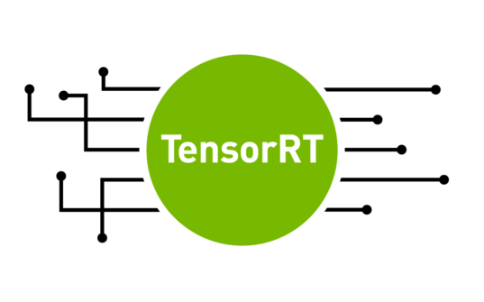

[![Stargazers][stars-shield]][stars-url]
[![Issues][issues-shield]][issues-url]
[![LinkedIn][linkedin-shield]][linkedin-url]

<br />
<p align="center">
  <a href="https://github.com/cyrusbehr/tensorrt-cpp-api">
    
  </a>

  <h3 align="center">TensorRT C++ API</h3>

  <p align="center">
    <b>A modern, no-throw C++ library for high-performance GPU inference of CNN models with NVIDIA TensorRT — with optional zero-copy Python bindings.</b>
  </p>
</p>

---

`tensorrt_cpp_api` turns an ONNX model into a cached, optimized TensorRT engine and runs it with
a small, leak-free API: name-keyed tensors at the boundary, caller-owned CUDA streams, explicit
host/device transfers, and a `Status`/`Result<T>` error model — no exceptions, no OpenCV or
TensorRT types in the public headers. It targets **TensorRT ≥ 10** (built to the TensorRT 11
surface), CUDA 12, C++20, Linux.

```cpp
#include <tensorrt_cpp_api/all.h>
using namespace trtcpp;

int main() {
    // Build an FP16 engine from ONNX, or load it from the on-disk cache if one is already current.
    BuildOptions opt;
    opt.precision = Precision::kFp16;
    opt.engineCacheDir = "engines";
    auto engine = EngineBuilder{}.buildAndLoad("model.onnx", opt);
    if (!engine) {
        std::fprintf(stderr, "%s\n", engine.status().message().c_str());
        return 1;
    }

    Stream stream;  // owns a CUDA stream — or Stream::wrap(existingHandle) to use yours
    auto input = Tensor::allocate(DType::kFloat32, Shape{1, 3, 640, 640}, Device::kCuda).value();
    // ... fill `input` (e.g. via the fused preproc kernel) ...

    auto output = engine->inferSingle({{engine->inputNames().front(), input.view()}}, stream);
    if (!output) return 1;

    auto host = output->toHost(stream).value();   // explicit D2H + sync; never implicit
    std::span<const float> scores = host.as<float>().value();
    // ... post-process `scores` ...
}
```

## Features

- **Engine cache that's actually safe.** Build-or-load keyed by ONNX content hash + build options
  + TensorRT version + GPU UUID, with a JSON sidecar and atomic writes. A stale cache (changed
  model, options, driver, or GPU) is detected and rebuilt instead of silently misused.
- **Dynamic shapes, done right.** Per-input min/opt/max optimization profiles; `-1`-aware `Shape`;
  one optimization profile per execution context for concurrent dynamic-shape inference.
- **Concurrency.** `EnginePool` leases execution contexts for multi-stream inference; every call
  runs on a caller-provided `Stream`. The engine is thread-compatible; the pool is thread-safe.
- **No leaky abstractions.** No `nvinfer1`, OpenCV, or spdlog types in any public header (PImpl +
  version-gated, generated `build_config.h`). Consumers need TensorRT at runtime, not compile time.
- **Quantization without surprises.** `Precision::kFp16` / `kInt8Qdq` / `kFp8` …; precision is
  version-aware and never a silent no-op (it errors clearly when a mode isn't achievable).
- **Optional fused preprocessing** (`tensorrt_cpp_api::preproc`): one CUDA kernel does
  letterbox-resize → BGR↔RGB → per-channel normalize → HWC→NCHW → cast, no intermediate buffers.
- **Optional zero-copy Python bindings** (`trtcpp`): feed CuPy / PyTorch / Numba GPU arrays in and
  get them back via `__cuda_array_interface__` / DLPack — no host round-trips, GIL released during
  inference. See [`examples/python`](examples/python).
- **Installable.** `cmake --install` produces a `find_package(tensorrt_cpp_api)`-consumable package.

## Performance

Single-stream inference latency on an **RTX 3080 Laptop GPU** (preallocated, zero-copy `enqueue`
loop — `examples/benchmark`), TensorRT 10:

| Model | Precision | Latency | Throughput |
|---|---|---|---|
| YOLOv8n | FP16 | 1.07 ms | 937 inf/s |
| YOLOv8n | FP32 | 2.00 ms | 499 inf/s |
| MobileNetV2 | FP16 | 0.31 ms | 3199 inf/s |

Inference time is TensorRT-bound — it is the `enqueueV3` cost of the engine, so the wrapper adds
**no** inference overhead (v6 and v7 run the identical engine on identical hardware in the same
time). v7's gains are on the host side and in safety: zero-copy name-keyed IO with no per-call
allocations or nested-vector copies, a stream-ordered allocator, and the no-throw `Status`/`Result`
API. The Python bindings run the same path within ~13% of C++ (`examples/python/benchmark_parity.py`).

> For reference, v6's published figures (a weaker RTX 3050 Ti Laptop GPU) were YOLOv8n FP16
> 2.49 ms / FP32 4.73 ms; the headline difference above is the GPU, not the wrapper.

## Install

TensorRT and CUDA are system/externally provided. In brief:

```sh
cmake -S . -B build -DTRT_CPP_API_BUILD_PREPROC=ON        # add -DTensorRT_DIR=<root> for a tarball
cmake --build build -j$(nproc)
cmake --install build --prefix /opt/trtcpp
```

Then in a downstream project:

```cmake
find_package(tensorrt_cpp_api REQUIRED)
target_link_libraries(myapp PRIVATE tensorrt_cpp_api::tensorrt_cpp_api tensorrt_cpp_api::preproc)
```

Python: `pip install .` (builds the `trtcpp` wheel via scikit-build-core). Full details —
apt vs tarball TensorRT, build options, Python — are in [`docs/install.md`](docs/install.md).

## Examples

[`examples/`](examples) has four runnable reference programs, each consuming the installed package:
**classification** (ImageNet top-5), **detection** (YOLOv8n + NMS), **segmentation** (DeepLabV3),
and a **zero-copy Python** demo with a C++/Python perf-parity benchmark. `examples/download_models.sh`
fetches the models.

## Documentation

- [Quickstart & core concepts](docs/quickstart.md)
- [Installation](docs/install.md)
- [Upgrading from v6](docs/upgrading_from_v6.md)
- API reference: `doxygen Doxyfile` (HTML in `docs/api/`)

## Sister projects

This library is the inference backend for [YOLOv8-TensorRT-CPP](https://github.com/cyrusbehr/YOLOv8-TensorRT-CPP)
and [YOLOv9-TensorRT-CPP](https://github.com/cyrusbehr/YOLOv9-TensorRT-CPP) (object detection,
segmentation, pose).

## Scope

Linux, CUDA 12, TensorRT ≥ 10, CNN-style vision models. Windows and LLM/transformer-specific
features are out of scope.

## Contributing

Issues and PRs welcome. Install the hooks with `pre-commit install` (clang-format + cmake-format);
CI runs the build, the CPU test suite, sanitizers, and a Python wheel build. If this project helps
you, a ⭐ is appreciated — connect on [LinkedIn](https://www.linkedin.com/in/cyrus-behroozi/).

### Contributors

<!-- ALL-CONTRIBUTORS-LIST:START - Do not remove or modify this section -->
<!-- prettier-ignore-start -->
<!-- markdownlint-disable -->
<table>
  <tbody>
    <tr>
      <td align="center" valign="top" width="14.28%"><a href="https://ltetrel.github.io/"><br /><sub><b>Loic Tetrel</b></sub></a><br /><a href="https://github.com/cyrusbehr/tensorrt-cpp-api/commits?author=ltetrel" title="Code">💻</a></td>
      <td align="center" valign="top" width="14.28%"><a href="https://github.com/thomaskleiven"><br /><sub><b>thomaskleiven</b></sub></a><br /><a href="https://github.com/cyrusbehr/tensorrt-cpp-api/commits?author=thomaskleiven" title="Code">💻</a></td>
      <td align="center" valign="top" width="14.28%"><a href="https://github.com/qq978358810"><br /><sub><b>WiCyn</b></sub></a><br /><a href="https://github.com/cyrusbehr/tensorrt-cpp-api/commits?author=qq978358810" title="Code">💻</a></td>
    </tr>
  </tbody>
</table>
<!-- markdownlint-restore -->
<!-- prettier-ignore-end -->
<!-- ALL-CONTRIBUTORS-LIST:END -->

This project follows the [all-contributors](https://github.com/all-contributors/all-contributors) specification.

## License

See [LICENSE](LICENSE). Version history is in [CHANGELOG.md](CHANGELOG.md).

<!-- MARKDOWN LINKS & IMAGES -->
[stars-shield]: https://img.shields.io/github/stars/cyrusbehr/tensorrt-cpp-api.svg?style=flat-square
[stars-url]: https://github.com/cyrusbehr/tensorrt-cpp-api/stargazers
[issues-shield]: https://img.shields.io/github/issues/cyrusbehr/tensorrt-cpp-api.svg?style=flat-square
[issues-url]: https://github.com/cyrusbehr/tensorrt-cpp-api/issues
[linkedin-shield]: https://img.shields.io/badge/-LinkedIn-black.svg?style=flat-square&logo=linkedin&colorB=555
[linkedin-url]: https://linkedin.com/in/cyrus-behroozi/
